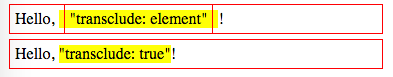

AngularJS1 Directive `transclude: 'element'`Demo
================================================

`transclude: 'element'`与`transclude: true`很像，区别就是'element'会把整个元素转移过去，而`true`仅仅把内部元素转移过去。

```
npm install
open index.html
```



Resources
---------

- AngularJS1: <https://angularjs.org/>
- directive `transclude` api: <https://docs.angularjs.org/api/ng/service/$compile#transclusion>
- $element api: <https://docs.angularjs.org/api/ng/function/angular.element#angularjs-s-jqlite>